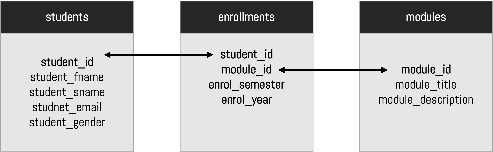
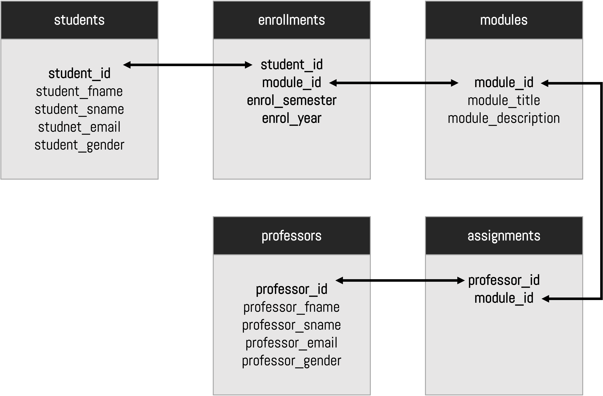

### Part-3


####  Running the commands on the GCP

* **To run this tutorial, you should start your MySQL server on the GCP.** 

1. First, you must set up your command line to the current project id.

2. Type the following command and press enter. Make sure you replace the `<PROJECT_ID>` with your project id, as presented in the previous video.

```shell
$ gcloud config set project <PROJECT_ID>
```

>  Enter a new password when prompted.
>  :rotating_light: Do not expect to see any characters on the screen! 

Then, connect to the SQL server using the next command, by replacing `<SQL-SERVER>` with your server.

```shell
$ gcloud sql connect <SQL-SERVER> --user=root
```

3. Let us run the following commands and learn how to use the MySQL command line interface (CLI).
4. List the databases (e.g. the `film_db`) that you created in the previous class.

```sql
mysql> SHOW DATABASES;
+--------------------+
| Database           |
+--------------------+
| DBname             |
| film_db            |
| information_schema |
| lab1_exercise_db   |
| movies_db          |
| mydb               |
| mysql              |
| performance_schema |
| sys                |
+--------------------+
9 rows in set (0.11 sec)
```

5. We will create a new database called `university_db`.

```sql
mysql> CREATE DATABASE university_db;
Query OK, 1 row affected (0.11 sec)
```

> The database is now ready so that we can `use` it.
>
> If you run the `SHOW DATABASES` command once more, the new database, it will appear on the list.

6. Select the `university_db` database as the current database to work on.

```sql
mysql> USE university_db;
Database changed
```

7. Create a new table called `students`, following the following data and specification.

   a. The table looks like this:

| student_id | student_fname | student_lname | student_email    |
| ---------- | ------------- | ------------- | ---------------- |
| S1         | Mary          | Brown         | mary@bbk.ac.uk   |
| S2         | John          | Brown         | john@bbk.ac.uk   |
| S3         | Tom           | Wilson        | tom@bbk.ac.uk    |
| S4         | Martha        | Aniston       | martha@bbk.ac.uk |

The table specification is as follows:

* `student_id` is a VARCHAR of 20 characters and is a primary key.
* `student_fname` is a `VARCHAR` of 20 characters.
* `student_sname` is a `VARCHAR` of 20 characters.
* `student_email` is a `VARCHAR` of 20 characters.
* `student_gender` is a `VARCHAR` of 20 characters.

> Do not worry about the records for the moment; we only care about the creation of our table.

8. To create the `students` table, run the following script.

```sql
CREATE TABLE students(
student_id VARCHAR (20),
student_fname VARCHAR(20),
student_sname VARCHAR(20),
student_email VARCHAR(20),
student_gender VARCHAR(20),
PRIMARY KEY(student_id)
);
```

9. Now, run the `SHOW` command to see the available tables in the selected database.

```
mysql> show TABLES;
+-------------------------+
| Tables_in_university_db |
+-------------------------+
| students                |
+-------------------------+
1 row in set (0.11 sec)
```

10. Run the `DESCRIBE` command for the `students` table.

```shell
mysql> DESCRIBE students;
+----------------+-------------+------+-----+---------+-------+
| Field          | Type        | Null | Key | Default | Extra |
+----------------+-------------+------+-----+---------+-------+
| student_id     | varchar(20) | NO   | PRI | NULL    |       |
| student_fname  | varchar(20) | YES  |     | NULL    |       |
| student_sname  | varchar(20) | YES  |     | NULL    |       |
| student_email  | varchar(20) | YES  |     | NULL    |       |
| student_gender | varchar(20) | YES  |     | NULL    |       |
+----------------+-------------+------+-----+---------+-------+
5 rows in set (0.11 sec)
```

11. Let us insert the data into the database using the following command.

* Be extra careful when you type long commands. It is recommended that you type the commands in an editor and then paste it to the Google shell.

```sql
INSERT INTO 
students
VALUES 	
('S1','Mary','Brown','mary@bbk.ac.uk','F'),
('S2','John','Brown','john@bbk.ac.uk','M'),
('S3','Tom','Wilson','tom@bbk.ac.uk','M'),
('S4','Martha','Aniston','martha@bbk.ac.uk','F');
```

> Note that a successful command output should looks like this:
>
> ```shell
> Query OK, 4 rows affected (0.11 sec)
>    Records: 4  Duplicates: 0  Warnings: 0
> ```

13. Let us run our first query to extract all the data from the `cities` table. For this query, you will use the `SELECT` command, so run the following script.

```mysql
mysql> SELECT * from students;

+------------+---------------+---------------+------------------+----------------+
| student_id | student_fname | student_sname | student_email    | student_gender |
+------------+---------------+---------------+------------------+----------------+
| S1         | Mary          | Brown         | mary@bbk.ac.uk   | F              |
| S2         | John          | Brown         | john@bbk.ac.uk   | M              |
| S3         | Tom           | Wilson        | tom@bbk.ac.uk    | M              |
| S4         | Martha        | Aniston       | martha@bbk.ac.uk | F              |
+------------+---------------+---------------+------------------+----------------+
4 rows in set (0.10 sec)
```

14. Create a new table called `modules`.

| **module_id** | **module_title**  | **module_description**        |
| ------------- | ----------------- | ----------------------------- |
| M1            | Python            | Programming  with Python      |
| M2            | Machine  Learning | Machine  Learning with Python |
| M3            | Data  analytics   | Data  analytics with Python   |

The table specification is as follows:

* `module_id` is a `VARCHAR` of 20 characters and is a primary key.
* `module_title` is a `VARCHAR` of 20 characters.
* `module_description` is a `TEXT` field.

15. The next command creates the `modules` table. 

```mysql
CREATE TABLE modules(
module_id VARCHAR (20),
module_title VARCHAR(20),
module_description TEXT,
PRIMARY KEY(module_id)
);
```

16. Now, let's insert the data.

```mysql
INSERT INTO modules VALUES
('M1','Python','Programming with Python'),
('M2','Machine Learning','Machine Learning with Python'),
('M3','Data analytics','Data analytics with Python');
```

17. Let's extract all the data of the `modules` table.

```mysql
mysql> SELECT * FROM modules;
+-----------+------------------+------------------------------+
| module_id | module_title     | module_description           |
+-----------+------------------+------------------------------+
| M1        | Python           | Programming with Python      |
| M2        | Machine Learning | Machine Learning with Python |
| M3        | Data analytics   | Data analytics with Python   |
+-----------+------------------+------------------------------+
3 rows in set (0.10 sec)
```

18. Let's create the `enrollments` table using the using the appropriate primary keys.

* **A student can enrol only one time in a module per semester**. You should define the appropriate rules to protect the database from inconsistent records.
* First let's examine the table:

| student_id | module_id | enrol_semester | enrol_year |
| ---------- | --------- | -------------- | ---------- |
| S1         | M1        | Autumn         | 2022       |
| S1         | M2        | Autumn         | 2022       |

* The table specification is as follows:
  * `student_id` is a `VARCHAR` of 20 characters and is a composite key. This specification has to match the one of the `student_id` of `students` table.
  * `module_id` is a `VARCHAR` of 20 characters and is a composite key. This specification has to match the one of the `module_id` of `modules` table.
  * `enrol_semester` is a `VARCHAR` of 20 characters and is a composite key.
  * `enrol_year` is an `INTEGER` of 4 digits and is a composite key.
* The following SQL script creates the table.

```mysql
CREATE TABLE enrollments(
student_id VARCHAR (20),
module_id VARCHAR (20),
enrol_semester VARCHAR (20),
enrol_year INT(4),
PRIMARY KEY(student_id,module_id,enrol_semester,enrol_year),
CONSTRAINT FK1 FOREIGN KEY (student_id) REFERENCES students(student_id),
CONSTRAINT FK2 FOREIGN KEY (module_id) REFERENCES modules(module_id)
);
```

* The table follows the next structure:



19. Let's insert the records into the `enrollments` table.

```mysql
INSERT INTO enrollments 
VALUES
('S1','M1','Autumn','2022'),
('S1','M2','Autumn','2022');
```

* Run the folloiwing command to extract the current enrollements.

```mysql
mysql> SELECT * FROM enrollments;
+------------+-----------+----------------+------------+
| student_id | module_id | enrol_semester | enrol_year |
+------------+-----------+----------------+------------+
| S1         | M1        | Autumn         |       2022 |
| S1         | M2        | Autumn         |       2022 |
+------------+-----------+----------------+------------+
2 rows in set (0.10 sec)
```

18. Let’s test the composite primary key. Let us assume that we accidentally run the following:
    * Student `S1` retakes module `M1` in the Autumn 2022.

```mysql
INSERT INTO enrollments VALUES
('S1','M1','Autumn','2022');
```

* This query will fail as this record already exists. The composite key works!

```mysql
ERROR 1062 (23000): Duplicate entry 'S1-M1-Autumn-2022' for key 'enrollments.PRIMARY'
```

19. Let's insert a new enrollment. Let's assume that:
    * Student `S2` enrols to modules `M2` and `M3` in Autumn, 2022.

```mysql
INSERT INTO enrollments VALUES
('S2','M2','Autumn',2022),
('S2','M3','Autumn',2022);
```

* The data it should be now inserted, and this is the output.

```
Query OK, 2 rows affected (0.11 sec)
Records: 2  Duplicates: 0  Warnings: 0
```

20. Let’s test the foreign key constraints. Let us assume that we accidentally try the following:
    * Student S1 takes module M22 (that does not exist) in modules table

```mysql
INSERT INTO enrollments VALUES
('S1','M22','Autumn',2022);
```

:rotating_light: This command fails as the `M22`** does not exist in the `modules` table. The output explains the error.

```mysql
ERROR 1452 (23000): Cannot add or update a child row: a foreign key constraint fails (`university_db`.`enrollments`, CONSTRAINT `FK2` FOREIGN KEY (`module_id`) REFERENCES `modules` (`module_id`))
```

21. We succesfully created the `university` database and we linked the tables according to the relational model. Now, let us try SQL queries to extract data.

* Run the following command to extract all the columns using the inner join. We need to make sure that we link the appropriate keys, that are:
  * Students to enrollments: `students.student_id = enrollments.student_id`
  * Modules to enrollements:`modules.module_id = enrollments.module_id`


```mysql
SELECT students.student_fname, students.student_sname, modules.module_title 
FROM students, modules, enrollments
WHERE
students.student_id = enrollments.student_id 
AND 
modules.module_id = enrollments.module_id;
```

* The output looks like this.

```mysql
+---------------+---------------+------------------+
| student_fname | student_sname | module_title     |
+---------------+---------------+------------------+
| Mary          | Brown         | Python           |
| Mary          | Brown         | Machine Learning |
| John          | Brown         | Machine Learning |
| John          | Brown         | Data analytics   |
+---------------+---------------+------------------+
4 rows in set (0.11 sec)
```

22. What are the modules that `S1` is enrolled to?

```mysql
SELECT students.student_fname, students.student_sname, modules.module_title 
FROM students, modules, enrollments
WHERE
students.student_id = enrollments.student_id 
AND 
modules.module_id = enrollments.module_id
AND 
students.student_id='S1';

+---------------+---------------+------------------+
| student_fname | student_sname | module_title     |
+---------------+---------------+------------------+
| Mary          | Brown         | Python           |
| Mary          | Brown         | Machine Learning |
+---------------+---------------+------------------+
2 rows in set (0.10 sec)
```

23 Which students are enrolled in the `Data analytics` module.

```mysql
SELECT students.student_fname, students.student_sname, modules.module_title 
FROM students, modules, enrollments
WHERE
students.student_id = enrollments.student_id 
AND 
modules.module_id = enrollments.module_id
AND 
modules.module_title='Data analytics';

+---------------+---------------+----------------+
| student_fname | student_sname | module_title   |
+---------------+---------------+----------------+
| John          | Brown         | Data analytics |
+---------------+---------------+----------------+
1 row in set (0.11 sec)
```

24. What modules are Mary Brown enrolled to?

```mysql
SELECT students.student_id,students.student_fname, students.student_sname, modules.module_title 
FROM students,modules,enrollments
WHERE
students.student_id = enrollments.student_id 
AND 
modules.module_id = enrollments.module_id 
AND 
students.student_fname='Mary'
AND 
students.student_sname='Brown';

+------------+---------------+---------------+------------------+
| student_id | student_fname | student_sname | module_title     |
+------------+---------------+---------------+------------------+
| S1         | Mary          | Brown         | Python           |
| S1         | Mary          | Brown         | Machine Learning |
+------------+---------------+---------------+------------------+
2 rows in set (0.10 sec)
```

25. How many students are enrolled per module?

```mysql
SELECT modules.module_title , COUNT(modules.module_title)
FROM students,modules,enrollments
WHERE
students.student_id = enrollments.student_id 
AND 
modules.module_id = enrollments.module_id 
GROUP BY modules.module_title;

+------------------+-----------------------------+
| module_title     | COUNT(modules.module_title) |
+------------------+-----------------------------+
| Python           |                           1 |
| Machine Learning |                           2 |
| Data analytics   |                           1 |
+------------------+-----------------------------+
3 rows in set (0.10 sec)
```

26. How many students are enrolled in the `Machine Learning` module?

```mysql
SELECT modules.module_title , COUNT(modules.module_title)
FROM students,modules,enrollments
WHERE
students.student_id = enrollments.student_id 
AND 
modules.module_id = enrollments.module_id 
AND 
modules.module_title='Machine Learning'
GROUP BY modules.module_title;

+------------------+-----------------------------+
| module_title     | COUNT(modules.module_title) |
+------------------+-----------------------------+
| Machine Learning |                           2 |
+------------------+-----------------------------+
1 row in set (0.10 sec)
```

27. Which modules have two or more enrolments?

```mysql
SELECT modules.module_title , COUNT(modules.module_title)
FROM students,modules,enrollments
WHERE
students.student_id = enrollments.student_id 
AND 
modules.module_id = enrollments.module_id 
GROUP BY modules.module_title
HAVING COUNT(modules.module_title)>=2;

+------------------+-----------------------------+
| module_title     | COUNT(modules.module_title) |
+------------------+-----------------------------+
| Machine Learning |                           2 |
+------------------+-----------------------------+
1 row in set (0.10 sec)
```

28. Let's create the `professors` table.

| professor_id | professor_fname | professor_sname | professor_email  | professor_gender |
| ------------ | --------------- | --------------- | ---------------- | ---------------- |
| P1           | Alex            | Rory            | alex@bbk.ac.uk   | F                |
| P2           | Olivia          | Harrison        | olivia@bbk.ac.uk | F                |
| P3           | George          | Max             | george@bbk.ac.uk | M                |
| P4           | Lucas           | Logon           | lucas@bbk.ac.uk  | F                |

28. Let’s create the SQL script.

* The table specification is as follows:
  * All fields are `VARCHAR(20)`, and the `professor_id` is a `PRIMARY KEY`.

```mysql
CREATE TABLE professors(
professor_id VARCHAR (20),
professor_fname VARCHAR(20),
professor_sname VARCHAR(20),
professor_email VARCHAR(20),
professor_gender VARCHAR(20),
PRIMARY KEY(professor_id)
);
```

28. Let's insert the data

```mysql
INSERT INTO professors VALUES 	
('P1','Alex','Rory','alex@bbk.ac.uk','F'),
('P2','Olivia','Harrison','olivia@bbk.ac.uk','F'),
('P3','George','Max','george@bbk.ac.uk','M'),
('P4','Lucas','Logon','lucas@bbk.ac.uk','F');
```

28. Create a table called `assignments` using the appropriate constraints. As before we will link the tables using the foreign keys.

* The table structure looks as follow.



* Run the next query

```mysql
CREATE TABLE assignment(
professor_id VARCHAR (20),
module_id VARCHAR (20),
PRIMARY KEY(professor_id,module_id),
CONSTRAINT FK3 FOREIGN KEY (professor_id) REFERENCES professors(professor_id),
CONSTRAINT FK4 FOREIGN KEY (module_id) REFERENCES modules(module_id)
);
```

28. Now let's insert the data.

```mysql
INSERT INTO assignment VALUES
('P2','M2'),
('P2','M3');
```

29. Time to extract data using all the tables.
    * Let's create a query to extract student name, module title and the professor name. By this way we can see who is taught by which professor in which module.

```mysql
SELECT 
students.student_fname,students.student_sname,
modules.module_title, 
professors.professor_fname,professor_sname

FROM 
students,modules,enrollments,
professors,assignment

WHERE
students.student_id = enrollments.student_id 
AND 
modules.module_id = enrollments.module_id
AND 
professors.professor_id = assignment.professor_id
AND
modules.module_id = assignment.module_id;

+---------------+---------------+------------------+-----------------+-----------------+
| student_fname | student_sname | module_title     | professor_fname | professor_sname |
+---------------+---------------+------------------+-----------------+-----------------+
| Mary          | Brown         | Machine Learning | Olivia          | Harrison        |
| John          | Brown         | Machine Learning | Olivia          | Harrison        |
| John          | Brown         | Data analytics   | Olivia          | Harrison        |
+---------------+---------------+------------------+-----------------+-----------------+
3 rows in set (0.11 sec)
```

30. Who is the professor of Mary Brown (with ID `S1`)? Let's print also the module title.

```mysql
SELECT 
students.student_fname,students.student_sname,
modules.module_title, 
professors.professor_fname,professor_sname

FROM 
students,modules,enrollments,
professors,assignment

WHERE
students.student_id = enrollments.student_id 
AND 
modules.module_id = enrollments.module_id
AND 
professors.professor_id = assignment.professor_id
AND
modules.module_id = assignment.module_id
AND
students.student_id='S1';

+---------------+---------------+------------------+-----------------+-----------------+
| student_fname | student_sname | module_title     | professor_fname | professor_sname |
+---------------+---------------+------------------+-----------------+-----------------+
| Mary          | Brown         | Machine Learning | Olivia          | Harrison        |
+---------------+---------------+------------------+-----------------+-----------------+
1 row in set (0.11 sec)
```

31. How many students taught by Professor Olivia Harrison?

```mysql
SELECT 
professors.professor_fname,professors.professor_sname,
COUNT(professors.professor_fname) AS 'Number of students'

FROM 
students,modules,enrollments,
professors,assignment

WHERE
students.student_id = enrollments.student_id 
AND 
modules.module_id = enrollments.module_id
AND 
professors.professor_id = assignment.professor_id
AND
modules.module_id = assignment.module_id
AND 
professors.professor_fname = 'Olivia'
AND
professors.professor_sname = 'Harrison';

+-----------------+-----------------+--------------------+
| professor_fname | professor_sname | Number of students |
+-----------------+-----------------+--------------------+
| Olivia          | Harrison        |                  3 |
+-----------------+-----------------+--------------------+
1 row in set (0.11 sec)
```

32. Let's insert some more data

```mysql
INSERT INTO assignment VALUES
('P1','M1');
```

32. This means that a new professor has been assigned for module `M1` (Python)
33. So, let's try the next query:
    * How many students each professor will have to teach in the autumn term?
      * For this example we will `GROUP BY` the data we want to extract.
      * We will also use an alias `AS` for the counter.

```mysql
SELECT 
professors.professor_fname,
professors.professor_sname,
enrollments.enrol_semester,
COUNT(professors.professor_fname) AS 'Number of students'

FROM 
students,modules,enrollments,
professors,assignment

WHERE
students.student_id = enrollments.student_id 
AND 
modules.module_id = enrollments.module_id
AND 
professors.professor_id = assignment.professor_id
AND
modules.module_id = assignment.module_id
AND 
enrollments.enrol_semester= 'Autumn'

GROUP BY
professors.professor_fname,professors.professor_sname,enrollments.enrol_semester;

+-----------------+-----------------+----------------+--------------------+
| professor_fname | professor_sname | enrol_semester | Number of students |
+-----------------+-----------------+----------------+--------------------+
| Olivia          | Harrison        | Autumn         |                  3 |
+-----------------+-----------------+----------------+--------------------+
```

33. Finally, let's extract how many students are per module.
    * For this example we will `GROUP BY` the `modules.module_title` and the `enrollments.enrol_semester`.

```mysql
SELECT 
modules.module_title,
COUNT(professors.professor_fname) AS 'Number of students'

FROM 
students,modules,enrollments,
professors,assignment

WHERE
students.student_id = enrollments.student_id 
AND 
modules.module_id = enrollments.module_id
AND 
professors.professor_id = assignment.professor_id
AND
modules.module_id = assignment.module_id
AND 
enrollments.enrol_semester= 'Autumn'

GROUP BY
modules.module_title,enrollments.enrol_semester;

+------------------+--------------------+
| module_title     | Number of students |
+------------------+--------------------+
| Python           |                  1 |
| Machine Learning |                  2 |
| Data analytics   |                  1 |
+------------------+--------------------+
3 rows in set (0.11 sec)
```

34. Well done :clap: , you completed the relational modelling MySQL tutorial!

:checkered_flag: Well done! 
